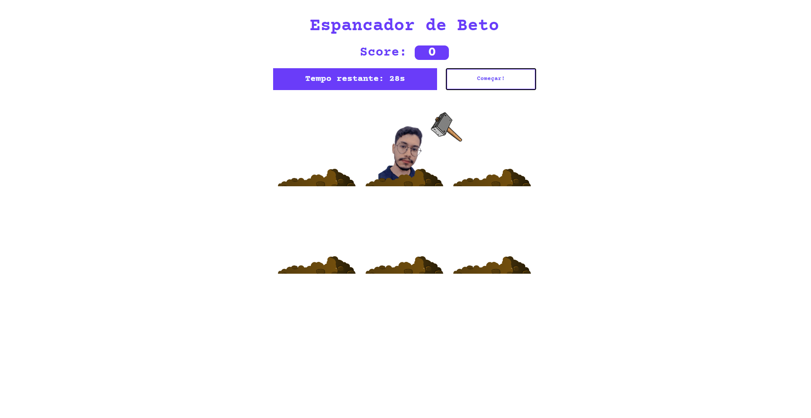

<h1 align="center">
 Jogo Espancador de Beto em JS
</h1>

<p align="center">
  

  
 
  

  <br>
  
  

  <a href="https://www.linkedin.com/in/joao-ressel/">
    
  </a>
</p>


<p align="center">
  
</p>

---

#  Índice

- :rocket: [Sobre o Projeto](#rocket-sobre-o-projeto)
- 👨‍💻️ [Tecnogias utilizadas](#%EF%B8%8F-tecnogias-utilizadas)
- 📦️ [Como utilizar o projeto](#%EF%B8%8F-como-utilizar-o-projeto)
- :rocket: [Link](#link)
---

## :rocket: Sobre o Repositório

Joguinho da toupeira personalizado com o rosto do meu amigo Flauberth, feito com javaScript puro.
Baseado no [repositório do Talison-Migel](https://github.com/Talison-Miguel/Jogo-Da-Topeira-JS)

---

## 👨‍💻️ Tecnogias utilizadas

✅ [ JavaScript ](https://developer.mozilla.org/pt-BR/docs/Web/JavaScript) <br/>
✅ [ CSS ](https://developer.mozilla.org/pt-BR/docs/Web/CSS) <br/>
✅ [ HTML ](https://developer.mozilla.org/pt-BR/docs/Web/HTML) <br/>

## 📦️ Como utilizar o projeto

Para copiar o projeto, utilize os comandos:

```bash
  ❯ git clone https://github.com/joao-ressel/espancador-de-beto
```
